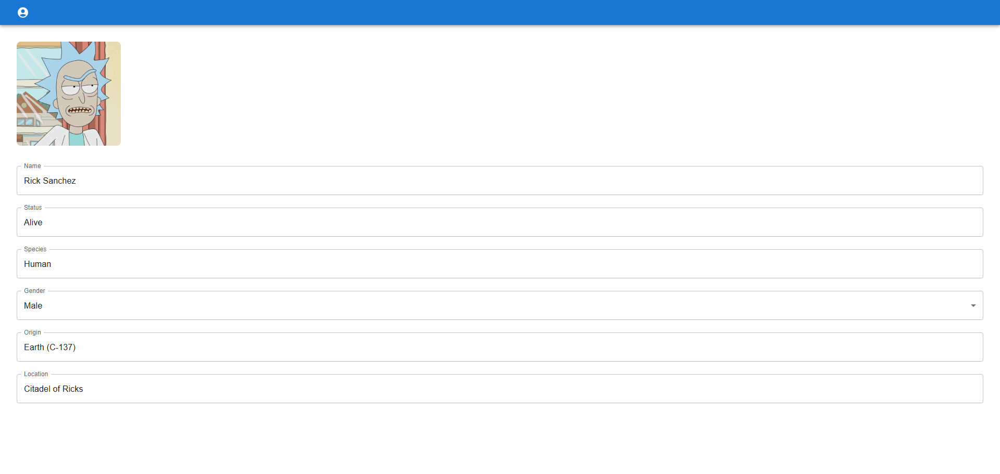

# Lab REST API — Ejercicio 1

Aplicación que consume la [API pública de Rick & Morty](https://rickandmortyapi.com/) para mostrar un listado de personajes y el detalle de cada uno.

## Qué se ha implementado

- Listado de personajes con llamada a la API usando Axios.
- Página de detalle con una segunda llamada por ID.
- **Challenge:** búsqueda por nombre (filtrado en servidor) y paginación.

## 📸 Capturas

### Vista principal - Plan semanal

### Vista de favoritos
